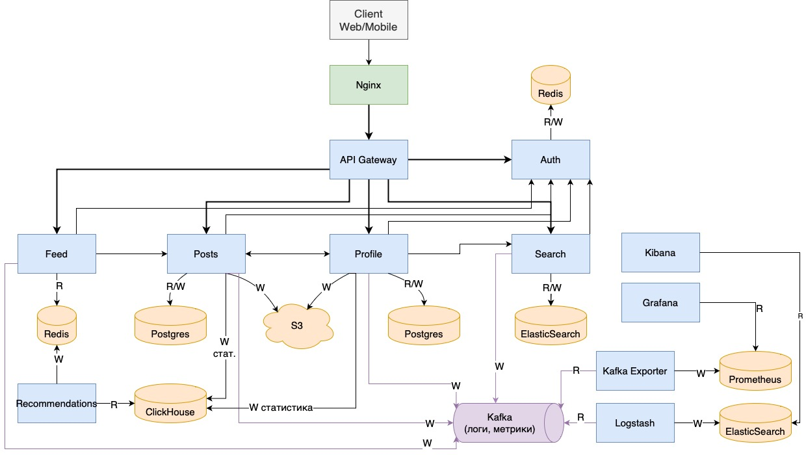

# Расчётно-пояснительная записка к курсовой работе по проектированию архитектуры высоконагруженного приложения

#### Методические указания: https://github.com/init/highload/blob/main/homework_architecture.md
## Содержание:
1. [Тема работы, основной функционал и аудитория](#1)
2. [Расчет нагрузки](#2)
3. [Глобальная балансировка нагрузки](#3)
4. [Локальная балансировка нагрузки](#4)
5. [Логическая схема БД](#5)
6. [Физическая схема БД](#6)
7. [Алгоритмы](#7)
8. [Технологии](#8)
9. [Обеспечение надёжности](#9)
10. [Схема проекта](#10)
11. [Список серверов](#11)
12. [Источники](#Источники)

## 1. Тема работы, основной функционал и аудитория <a name="1"></a>
Требуется разработать архитектуру высоконагруженного приложения для социальной сети Instagram

### Функционал MVP:
- Регистрация и авторизация пользователей
- Поиск пользователей
- Подписка на контент других пользователей
- Загрузка контента (фото/видео)
- Оценка контента (лайки, комментарии)
- Просмотр контента
- Просмотр и лайк комментариев
- Отметка пользователей под постом
- Хэштэги

### Целевая аудитория:
- 2 млрд. MAU (Monthly Active Users)
- 100 млн. фото и видео выкладывается на площадке каждый день
- 30 мин. в среднем проводят люди в Instagram

#### Распределение аудитории по странам:
| Страна         | Аудитория (млн. чел.) |
|----------------|-----------------------|
| Индия          | 230                   |
| США            | 160                   |
| Бразилия       | 120                   |
| Индонезия      | 100                   |
| Россия         | 63                    |
| Турция         | 52                    |
| Япония         | 46                    |
| Мексика        | 38                    |
| Великобритания | 32                    |
| Германия       | 30                    |

## 2. Расчет нагрузки <a name="2"></a>
Необходимо пересчитать аудиторные метрики в ключевые продуктовые и технические метрики.

### Продуктовые метрики
- 2 млрд. чел. MAU (Monthly Active Users)
- 500 млн. чел. DAU (Daily Active Users)
- 150 млн. новых пользователей зарегистрировались в 2023 году
- Предположительное число авторизаций одного пользователя в год - 3 раза
- 71.9% контента - фотографии, остальное видео
- 95 млн. новых постов каждый день (68.4 фото и 26.6 видео)
- 4.2 млрд. лайков и 1.2 млрд. комментариев каждый день
- 30 мин. проводит средний пользователь Instagram в день
- Предположительно пользователь просматривает 50 фото и 20 видео в день
- Предположительно пользователь ищет 1 профиль в день, а подписывается на каждого второго (0.5)

| Метрика                                                   | Значение | 
|-----------------------------------------------------------|----------|
| MAU (чел.)                                                | 2 млрд.  |
| DAU (чел.)                                                | 500 млн. |
| Прирост аудитории за 2023г.                               | 150 млн. |
| Число авторизаций пользователя в год одним пользователем  | 3        |
| Поиск других людей в день одним пользователем             | 1        |
| Подписок на профили в день одним пользователем            | 0.5      |
| Публикаций единиц контента в день одним пользователем     | 0.19     |
| Число лайков одним пользователем в день                   | 8.4      |
| Число комментариев одним пользователем в день             | 2.4      |
| Число просмотренных фотографий одним пользователем в день | 50       |
| Число просмотренных видео одним пользователем в день      | 20       |
| Получение комментариев к записи                           | 7        |

#### Средний размер харанилища пользователя по типам:
- Данные профиля (имя, описание профиля, подписки и т.д.) - 100 Кб
- Аватар профиля - 150 Кб
- Посты (фото, видео) - 500 Мб/год (Предположительно)

#### Среднее количество действий пользователя по типам в день
Берём в расчёт метрику DAU, а также приблизительные значения описанных выше метрик

| Действие пользователя  | Количество в день |
|------------------------|-------------------|
| Регистрация            | 410 тыс.          |
| Авторизация            | 16.6 млн.         |
| Поиск профиля          | 500 млн.          |
| Подписка на профиль    | 250 млн.          |
| Публикация фото        | 68.4 млн          |
| Публикация видео       | 26.6 млн.         |
| Лайк                   | 4.2 млрд.         |
| Комментарий            | 1.2 млрд.         |
| Просмотр фото          | 25 млрд.          |
| Просмотр видео         | 10 млрд.          |
| Получение комментариев | 3.5 млрд.         |


- Число регистраций (в день) 
```azure
Прирост за год / 365 = 150 млн. / 365 = 410 тыс.
```
- Число авторизаций (в день)
```azure
MAU * 3 / 12 / 30 = 16.6 млн.
```

### Технические метрики

#### Размер хранения в разбивке по типам данных
Учитывается размер хранения новых данных за год, так как данных об общем числе тех или иных 
данных за всю историю приложения нет. Например, считается размер хранения данных профилей
пользователей, зарегистрированных в 2023г. 

| Тип               | Количество (ед.) | Размер 1 ед. | Общий размер |
|-------------------|------------------|--------------|--------------|
| Фотографии        | 25 млрд.         | 2 Мб         | 50 Пб        |
| Видео             | 10 млрд          | 20 Мб        | 200 Пб       |
| Комментарии       | 430 млрд.        | 1 Кб         | 430 Тб       |
| Данные профиля    | 150 млн.         | 100 Кб       | 15 Тб        |
| Аватарки профилей | 150 млн.         | 150 Кб       | 22.5 Тб      |

#### RPS
Поскольку аудитория Instagram сильно разбросана по планете и часовым поясам, 
возьмём соотношение между среднесуточным и пиковым RPS - 1:2 

| Тип запроса            | RPS    | RPS пиковый |
|------------------------|--------|-------------|
| Регистрация            | 4.75   | 9.5         |
| Авторизация            | 192    | 384         |
| Поиск профиля          | 5800   | 11600       |
| Подписка на профиль    | 2900   | 5800        |
| Публикация фото        | 790    | 1580        |
| Публикация видео       | 308    | 616         |
| Лайк                   | 48611  | 97222       |
| Комментарий            | 13889  | 27778       |
| Просмотр фото          | 289350 | 578700      |
| Просмотр видео         | 115740 | 231480      |
| Получение комментариев | 40509  | 81018       |
|                        |        |             |
| Общее                  | 518000 | 1036000     |

#### Сетевой трафик
- Средний размер поста с фото - 500 Кб
- Средний размер поста с видео - 50 Мб

Посчитаем примерный объём трафика пользователями:
- Просмотров фото - 25 млрд/сут. публикаций - 68.4 млн/сут.
- Просмотров видео - 10 млрд/сут. публикаций - 26.6 млн/сут.

Трафик по видам постов:

| Тип поста | Суммарный суточный трафик, Пб | Потребление, Тб/сек. | Пиковое потребление, Тб/сек. |
|-----------|-------------------------------|----------------------|------------------------------|
| Фото      | 12.5                          | 0.145                | 0.29                         |
| Видео     | 501                           | 5.8                  | 11.6                         |
|           |                               |                      |                              |
| Итого     | 513.5                         | 5.945                | 11.89                        |

По аналогии с RPS считаем, что пиковое потребление трафика - x2 от среднего

## 3. Глобальная балансировка нагрузки <a name="3"></a>
### Расположение ДЦ
Выделим возможные расположения дата-центров с учётом географического распределения аудитории:
1. Северная Америка (США)
- Ашберн, Вирджиния (восточное побережье) (из-за его роли в качестве одного 
из крупнейших телекоммуникационных узлов в США)
- Сан Хосе, Калифорния (западное побережье)
2. Южная Америка
- Бразилия. Сан-Паулу (крупнейший город в Бразилии с развитой инфраструктурой, 
способный обслуживать пользователей по всей Южной Америке)
- Буэнос-Айрес, Аргентина
3. Азия 
- Сингапур (выступает в качестве ключевого телекоммуникационного и технологического хаба для Юго-Восточной Азии)
- Бангалор, Индия (один из крупнейших ДЦ)
4. Европа 
- Амстердам (один из крупнейших интернет-хабов в Европе с высокоразвитой инфраструктурой).
- Франкфурт (другой крупный интернет-хаб в Европе, имеющий один из самых больших интернет-обменных пунктов в мире).
5. Африка
- Йоханнесбург (ЮАР) (один из наиболее развитых городов Африки с хорошей технологической инфраструктурой, 
который может служить точкой доступа к интернету для южноафриканского региона).

### Глобальная балансировка
Для глобальной балансировки запросов и нагрузки будем использовать:
- GeoDNS для глобального направления. При получении запроса GeoDNS определяет географическое положение 
пользователя и направляет запрос в ближайший регион, где расположены дата-центры.
- BGP Anycast внутри региона для локальной оптимизации. Внутри выбранного региона все дата-центры анонсируют
один и тот же IP-адрес с использованием протокола BGP Anycast. Сетевые маршрутизаторы интернета автоматически 
направляют запрос к ближайшему дата-центру, который анонсирует данный IP-адрес. 
Это минимизирует задержки и обеспечивает балансировку нагрузки между дата-центрами в регионе.

В случае выхода из строя одного ДЦ, BGP Anycast будет отправлять трафик на второй в регионах, где их несколько.
Если же выйдет ДЦ в Африке, где он один, GeoDNS будет балансировать запросы на ближайший
регион с рабочим ДЦ (Европа). Поскольку аудитория Instagram в Африке не очень большая, то запаса 
европейских ДЦ должно хватить на время восстановления африканского.

## 4. Локальная балансировка нагрузки <a name="4"></a>

### Входящий трафик

- Входящий трафик будет встречать L4 LVS IP Tunnelling балансировщик, который распределяет трафик между несколькими
физическими серверами (кластерами серверов) внутри одного дата центра. Так как он работает на транспортном уровне, 
то обеспечивает высокую скорость обработки и маршрутизации запросов. В качестве метода выбора сервера будет 
использоваться стратегия Least Connections, которая поможет равномерно распределить нагрузку между серверами.

- На физических серверах разворачиваются кластеры Kubernetes. Таким образом, запрос, попав на тот или иной сервер, оказывается
внутри кластера Kubernetes, где для дальнейшей маршрутизации используется Nginx в роли Ingress Controller 
Nginx уже работает с прикладным протоколом и предоставляет гибкие возможности для балансировки и обработки запросов:
    - SSL-терминация
    - Кеширование и сжатие статики
    - Решает проблему с "медленными клиентами"
    - Retry запросов после падения одного из серверных узлов   
    - Перезапуск без downtime
  
    По дефолту в nginx используется стратегия round robin выбора сервера, однако при желании можно также распределять
трафик, например, по типам запросов.

- Затем трафик попадает уже на выбранный Nginx'ом pod, в котором происходит итоговая обработка. Ответы от подов направляются
обратно через Ingress Controller, который может выполнять дополнительную обработку ответов (Например, кэширование)

### Межсервисный трафик

Поскольку почти все крупные системы имеют микросервисную архитектуру, то необходимо продумать и балансировку межсервисного
трафика. В данной архитектуре будет использоваться паттерн sidecar proxy, который предполагает размещение вспомогательного 
прокси рядом с каждым микросервисом. Этот подход позволяет снизить latency межсервисного взаимодействия. 

Istio предлагает комплексное решение для управления сервисной сетью (service mesh), используя Envoy в качестве sidecar proxy.
Он автоматически встраивает sidecar proxy (в данном случае Envoy - L7 балансировщик) в поды Kubernetes, что позволяет перехватывать весь входящий 
и исходящий трафик сервиса. Также он предоставляет возможности для мониторинга и обеспечения отказоустойчивости:
- Балансировка нагрузки: поддержка различных стратегий балансировки, включая round-robin, взвешенную балансировку и др.
- Обработка ошибок и повторных попыток: настройка правил для автоматических повторных попыток, тайм-аутов и ограничений на возврат ошибок для повышения устойчивости сервисов.
- Трассировка и мониторинг: автоматическое сбор метрик, логов и трассировок для всех микросервисов, позволяющее получить детальный анализ производительности и проблем.
- Визуализация: интеграция с инструментами визуализации (например, Kiali, Grafana, Prometheus) для наглядного отображения архитектуры системы, потоков трафика и метрик производительности.

### Схема отказоустойчивости

- На уровне L4 используем keepalived. Он обеспечивает высокую доступность и устойчивость к сбоям для балансировщиков нагрузки 
и других критически важных компонентов инфраструктуры. Оно позволяет минимизировать простои и обеспечивать непрерывность 
бизнес-процессов за счет быстрого переключения между серверами в случае отказа.

- На физических серверах высокий уровень отказоустойчивости поддерживает Kubernetes совместно с Nginx в качестве Ingress Controller
    - Autoscaling. Kubernetes позволяет масштабировать кол-во подов в зависимости от текущей загрузки
    - Self-healing. Используя readiness-пробы, Kubernetes мониторит состояние подов, при необходимости восстанавливает или удаляет и создаёт новый
    - Rolling updates. Deployments в Kubernetes поддерживают стратегию постепенного обновления подов, что позволяет обновлять приложения без простоев.
    - Nginx умеет перезапускаться без downtime
    - В случае недоступности одного из подов, Nginx автоматически перенаправляет трафик на другие доступные поды, минимизируя простои и обеспечивая непрерывность обслуживания пользователей.

- На межсервисном уровне за отказоустойчивость отвечает Istio, возможности которого были описаны в предыдущем пункте 

### Терминация SSL
Во время первоначального TLS-рукопожатия сервер (В нашем случае Nginx) генерирует session ticket который представляет собой зашифрованную запись состояния сессии, и отправляет его клиенту.
Он же сохраняет полученный билет сессии для последующего использования. Когда клиент хочет возобновить сессию с сервером, он отправляет ранее сохраненный билет сессии
в качестве части нового TLS-рукопожатия. Сервер расшифровывает билет, извлекает параметры сессии и использует их для возобновления сессии без необходимости проведения 
полного рукопожатия с обменом ключами. Поскольку внутри одного дата центра хосты имеют одинаковый ip адрес, работа данного механизма возможна, что значительно снизит нагрузку SSL терминацию.
Также можно шарить session cache между хостами, однако при перезапуске nginx он пропадает.

## 5. Логическая схема БД <a name="5"></a>


### Размеры данных в таблицах
Предполагаем использование кодировки UTF8 для полей varchar, возьмём средний вес одного символа в данной кодировке - 2 байта.
Тогда вес varchar(n) - 2*n байт, integer - 4 байта, timestamp ~ 8 байт, bool - 1 байт. Размер json файла с настройками аккаунта пользователя
можно оценить примерно в 300 байт. 
#### Оценим максимальный и средний вес одной записи для каждой таблицы:
| Название таблицы | Максимальный вес записи, байт | Средний, байт                         |
|------------------|-------------------------------|---------------------------------------| 
| Users            | 1556                          | 800                                   |
| Settings         | 304                           | 304                                   |
| Followers        | 8                             | 8                                     |
| Tagged_Users     | 8                             | 8                                     |
| Post_Hashtags    | 8                             | 8                                     |
| Hashtags         | 84                            | 40                                    |
| Posts            | 2084                          | 500                                   |
| Comments         | 592                           | 150                                   |
| Post_Likes       | 16                            | 16                                    |
| Comments_Likes   | 16                            | 16                                    |
| Sessions         | 16                            | 16                                    |
| Files            | 200 Мб (файл) + 28 байт       | 50 Мб (для видео) и 500 Кб (для фото) |

- Средний размер поста с фото - 500 Кб, с видео - 50 Мб (для CDN)

### Расчёт нагрузки на чтение и запись
| Название таблицы  | Средняя нагрузка на чтение (пиковая), RPS | Средняя нагрузка на запись (пиковая), RPS |
|-------------------|-------------------------------------------|-------------------------------------------|
| Users             | 5800 (11600)                              | 4.75 (9.5)                                |
| Settings          | 300 (600)                                 | 300 (600)                                 |
| Followers         | 5800 (11600)                              | 2900 (5800)                               |
| Tagged_Users      | 1200 (2400)                               | 790 (1580)                                |
| Post_Hashtags     | 1200 (2400)                               | 790 (1580)                                |
| Hashtags          | 1200 (2400)                               | 10 (20)                                   |
| Posts             | 405090 (810180)                           | 1098 (2196)                               |
| Comments          | 40509 (81018)                             | 13889 (27778)                             |
| Post_Likes        | 405090 (810180)                           | 48611 (97222)                             |
| Comments_Likes    | 40509 (81018)                             | 10000 (20000)                             |

## 6. Физическая схема БД <a name="6"></a>

### Денормализация БД
- В таблицу Posts можно добавить поля comments_count и likes_count. Это позволит избежать подсчета этих значений через дополнительные запросы к таблицам Comments и Posts_Likes.
- Аналогично, в таблицу Comments можно добавить поле likes_count.
- В таблицу Posts можно добавить поля user_name и user_img, чтобы для сборки поста не требовалось делать запрос к таблице Users.
- Аналогично для таблицы Comments
- В таблице Posts можно дополнительно хранить сразу список хэштэгов

### Индексы по таблицам

- #### Users
Вешаем индекс на Email для быстрого поиска при авторизации, а также на поля Nickname и Name (не составной) для оптимизации бизнес логики
поиска людей.

- #### Posts
Добавим индекс на поле User_Id, чтобы ускорить поиск постов определенного пользователя

- #### Comments
Добавим индекс на поле Post_Id, чтобы ускорить извлечение комментариев к нужному посту, а также на поле Parrent_Comment_Id, чтобы 
ускорить извлечение комментариев под другим определённым комментарием

- #### Post_Likes
Индекс на Post_Id, чтобы ускорить операции по определению числа лайков на посте

- #### Comment_Likes
Индекс на Comment_Id, чтобы ускорить операции по определению числа лайков на посте

- #### Followers
Индексы на Followed_Id, чтобы ускорить операции по нахождению подписчиков данного пользователя и на Follower_Id для оптимизации
поиска подписок пользователя

- #### Tagged_Users
Индексы на Post_Id, чтобы ускорить поиск отмеченных людей на посте и на User_Id для оптимизации поиска постов, на котором отмечен 
данный пользователь

- #### Post_Hashtags
Индексы на Post_Id, чтобы ускорить поиск хэштегов к посту и на Hashtag_Id для оптимизации поиска постов, соответствующих данному хэштэгу

- #### HashTags
Индекс на Name, чтобы ускорить поиск нужного хэштэга

### Выбор СУБД
- PostgreSQL в качестве основной реляционной СУБД
- Для таблицы Sessions будет использоваться in-memory key-value хранилище Redis, который предоставляет хорошие возможности для масштабирования
в виде организации кластера, а также поддержку репликации master-slave. Однако нужно позаботиться о грамотной настройке сохранения данных на диск.
В производительности применение redis повысит производительность больше, чем 10 раз.

- Для хранения и раздачи файлов (фото и видео + статика) будет использоваться S3 хранилище. Фото и видео будут разбиты на бакеты по пользователям (uid) 
- Для хранения логов будем использовать Elastic Stack
- Для метрик - Prometheus и Grafana
- Стриминг данных - Kafka
- Аналитика - Clickhouse

### Реплекация <a name="Реплекация"></a>
Для основной Postgres базы данных будет использоваться схема асинхронной реплекации. Она позволяет отлично масштабировать нагрузку на
чтение данных, а также повышает надёжность системы. После записи в master будет происходить дублирование запросов на ведомых серверах. 
В данном случае будет присутствовать "отставание реплики". Поэтому стоит продумать, какие запросы на чтения чувствительны к задержке (их отправляем на master), 
а какие могут нет (их отправляем на реплики). При выходе из строя master базы, одна из реплик станет "горячим" резервом. Также с одной из реплик будут сниматься бэкапы, 
чтобы снизить нагрузку на master. 

### Шардирование и резевирование СУБД <a name="Шардирование"></a>
Будет использоваться виртуальное шардирование, цель которого - быстрое масштабирование в будущем. Суть которого:
- Разделение данных на большее число виртуальных шардов, чем имеется физических серверов
- Маппинг виртуальных шардов на физические узлы
- Когда потребуется масштабирование системы (например, добавление новых серверов), виртуальные шарды могут быть 
перераспределены между старыми и новыми серверами с минимальным перераспределением данных. 
Это облегчает балансировку нагрузки и оптимизацию производительности без значительной перенастройки всей системы.

#### Схема шардинга
- таблицу Users разбиваем по Id
- Setting по User_Id - настройки лежат рядом с самим пользователем
- Posts по Post_Id
- Followers по Follower_Id - оптимизируем получение списка всех подписок пользователя (Поскольку пользователи часто смотрят, на кого подписаны селебрити)
- Comments по Comments_Id
- Comments_Likes по Comment_Id - подсчёт числа лайков на комментарии
- Post_Likes по Post_Id - аналогично для постов

Такая схема позволит добиться равномерного распределения записей между шардами.   

Также стоит предусмотреть, что в социальных сетях есть активные пользователи, которые часто постят и имеют много подписчиков, активность их на страницах очень высокая. 
В таких случаях нужно под них резервировать больше места в бд, нежели под рядовых пользователей.

### Балансировака запросов / мультиплексирование подключений
Мультиплексирование подключений основано на идее использования пула соединений, где "живые" соединения с базой данных 
поддерживаются в открытом состоянии и переиспользуются для множества пользовательских сессий или запросов. 
Это позволяет избежать затрат на время и ресурсы, связанные с постоянным открытием и закрытием соединений. Также некоторые СУБД
(например, Postgres) начинают плохо работать при большом числе коннектов. Для нашей основной бд Postgres будет использоваться pgBouncer


### Схема резервного копирования
Будет использоваться комбинированное резервное копирование, суть которого в регулярном выполнении полного резервного копирования совместно с инкрементными или 
дифференциальными (изменившиеся данные) копированиями в промежутках между ними. Это позволяет достичь баланса между затратами на хранение, скоростью восстановления и минимизацией риска потери данных.

### Клиентские библиотеки / интеграции
Забегая вперёд, отмечу, что серверное приложения будет написано на Golang. Поэтому перечислим библиотеки для работы с упомянутыми СХД для Go:
- AWS SDK for Go (для S3 хранилищ)
- go-redis
- pgx (для Postgres)
- Confluent Kafka Go Client


## 7. Алгоритмы <a name="7"></a>

### Поиск
В бизнес-логике приложения предусмотрен поиск по пользователям и хэштегам. Для его реализации будет использоваться Elasticsearch -
мощная распределённая система поиска и анализа данных, которая предоставляет большой функционал, включая полнотекстовый поиск.

#### 1. Индексация данных
В Elasticsearch все данные хранятся в форме JSON-документов. Каждому документу присваивается уникальный ID и помещается в индекс.
Для ускорения поиска используется инвертированный индекс, который хранит отображение ключевых слов на места, где эти слова встречаются 
в документе или наборе документов. 
#### 2. Анализ текста
- Токенизация - процесс разбиения текста на слова или фразы. В Elasticsearch для этого могут использоваться различные токенизаторы, 
например, стандартные, whitespace, simple и другие.
- Фильтрация токенов. Включает стемминг (сокращение слова до основы), удаление стоп-слов (убирает распространённые слова, которые 
могут ухудшить качество поиска), синонимы (позволяет заменять слова их синонимами для улучшения результатов поиска) и множество других.
- N-Gram - техника, которая разбивает текст на последовательности n символов или слов, используемая для поддержки поиска по частям слов или фраз.
#### 3. Поиск
Elasticsearch автоматически ранжирует результаты поиска на основе их релевантности, используя алгоритмы, такие как TF-IDF и BM25. Оценка релевантности 
(скоринг) каждого документа вычисляется в зависимости от того, как часто и где в документе встречается поисковый запрос.


### "Проблема активных пользователей"
В предыдущей главе выделялась проблема популярных пользователей, у которых высокая активность, как на чтение их данных, так и на запись.
Для выделения таких юзеров необходимо проводить статистический анализ активности пользователей с помощью собираемых метрик. Немаловыжным
является постоянная переоценка таких аккаунтов, поскольку популярность - дело не постоянное.   

В случаях таких "суперактивных" пользователей нагрузку на запись уменьшаю выделением специальных шардов. Что касается чтения, что 
используется кэширование основной информации с помощью redis.

### Создание ленты
Лента с постами - это основной функционал сервиса Instagram, на который затрачивается около 50% времени, проведённого пользователем
в приложении. Поэтому необходимо грамотно составлять ленту, чтобы в первую очередь юзер видел наиболее релевантные посты.  

EdgeRank - алгоритм, который был разработан компанией Meta для ранжирования контента в новостной ленте пользователей. 
Хотя с тех пор используются более сложные алгоритмы машинного обучения, но основные концепции EdgeRank остаются 
важными для понимания того, как социальные сети могут ранжировать контент.

Алгоритм учитывает три основных фактора, чтобы определить, какой контент будет показан в новостной ленте пользователя:
1. Affinity Score (Оценка близости). Этот показатель отражает силу взаимоотношений между пользователем, просматривающим ленту, 
и источником контента. Эта "близость" формируется на основе активности пользователя — насколько часто он взаимодействует 
с постами определенного друга, группы или страницы. Взаимодействия могут включать лайки, комментарии, теги, сообщения и 
другие действия.
2. Weight (Вес). Каждому типу взаимодействия присваивается определенный "вес". Например, комментарии могут цениться выше, 
чем лайки, так как они подразумевают большую степень вовлеченности пользователя.
3. Time Decay (Устаревание): Этот фактор учитывает время, прошедшее с момента создания контента. Чем более "свежий" пост, 
тем выше его шансы быть показанным. С течением времени значение этого фактора для поста понижается, что означает, 
что старые посты постепенно исчезают из новостной ленты.  

В самом общем виде формула EdgeRank выглядит следующим образом:   
`EdgeRank = Affinity_Score × Weight × Time_Decay`  

Для определения Affinity Score в таких проектах используются мощные гибридные системы с машинным обучением. Но можно сказать 
точно, что большую роль играют подходы для генерации персонализированных рекомендаций. Существует два основных:
- Коллаборативная фильтрация.  
В основе данного подхода лежат чаще всего алгоритмы матричной факторизации, в частности такие как SVD (Singular Value Decomposition)
и более сложная его версия - ALS (Alternating Least Squares) с различными модификациями. Основная их суть в 
разложении матрицы взаимодействий на более низкоразмерные. При этом, каждый пользователь и каждый элемент контента представляются 
в виде вектора меньшей размерности, называемого скрытым фактором взаимодействия.
Процесс разложения матрицы сводится к нахождению оптимальных значений скрытых факторов, которые максимально точно 
приближают исходную разреженную матриц. Это позволяет заполнить пропуски в ней и предсказать оценки взаимодействия 
пользователей с новыми элементами контента.

- Контентно-ориентированный подход (content-based filtering CBF) – подход, который основан на анализе характеристик 
объектов и предпочтений пользователя. Вместо того чтобы опираться на предпочтения других пользователей, 
этот подход использует информацию о содержании объектов, такую как ключевые слова, жанр, автор и так далее для 
нахождения похожих объектов и рекомендации их пользователю. Одним из основных методов является векторное представление элементов контента.
Далее, для нахождения сходства между элементами контента используются различные метрики или алгоритмы, такие как Байесовский классификатор, 
TF/IDF, деревья решений и нейронные сети.


## 8. Технологии <a name="8"></a>
| Технология         | Область применения                                                | Обоснование                                                                                                                           |
|--------------------|-------------------------------------------------------------------|---------------------------------------------------------------------------------------------------------------------------------------|
| GitLab Self-Hosted | VCS, CI/CD                                                        | Независимость от внешнего мира, гибкая настройка и простота интеграции с другими технологиями                                         |
| Go                 | Основной ЯП сервера                                               | Производительный, компилируемый, типизированный, прост в освоении, лаконичный, изначально придуман для написания серверных приложений |
| Python             | Система рекомендаций контента                                     | Существование и поддержка наибольшего числа библиотек по машинному обучению                                                           |
| Swift & Kotlin     | Клиенты на мобильных устройствах                                  | Наиболее актуальные технологии под IOS & Android                                                                                      |
| JS/TS              | Web клиент                                                        | Отсутствие аналогов                                                                                                                   |
| Istio              | Service mesh                                                      | Комплексное готовое решение                                                                                                           |
| Nginx              | Веб-сервер, L7-балансировщик + Ingress Controller, SSL терминация | Решает проблему "медленных клиентов", кеширование и сжатие, перезапуск без downtime, retry запросов                                   |
| LVS                | L4-балансировка                                                   | Высокая скорость обработки и маршрутизации запросов                                                                                   |
| Docker             | Контейнеризация                                                   | Незаменим, интеграция с Kubernetes                                                                                                    |
| Kubernetes         | Оркестрация контейнеров, деплоймент                               | Де-факто стандарт в системах оркестрации, autoscaling, self-healing, rolling-updates                                                  |
| PostgreSQL         | Основная реляционная СУБД                                         | Производительность, расширяемость, масштабируемость, поддержка сообщества                                                             |
| pgBouncer          | Мультиплексирование запросов к Postgres                           | Гибкость конфигурации, легкость в развертывании                                                                                       |
| Redis              | key-value хранилище                                               | Производительность, инструменты для масштабирования "из коробки"                                                                      |
| S3                 | Раздача файлов                                                    | Масштабируемость, надёжность, безопасность                                                                                            |
| ElasticStack       | Система логирования, поиск                                        | Производительный полнотекстовый поиск, комплексное решение                                                                            |
| Prometheus         | Сбор и хранение метрик                                            | Производительный                                                                                                                      |
| Grafana            | Визуализация метрик, алерты                                       | Удобный, гибкая настройка и отображение метрик системы                                                                                |
| Kafka              | Стримминг данных                                                  | Надёжный, производительный, масштабируемый                                                                                            |
| ClickHouse         | Аналитическая СУБД                                                | Очень эффективное выполнение full-scan запросов, масштабируемость                                                                     |


## 9. Обеспечение надёжности <a name="9"></a>
### Аппаратные и сетевые ресурсы
- Резервирование линий связи.
- Резервные линии питания.
- Резервирование дисков и серверов (их кол-во, а также CPU + RAM), а также их охлаждения.
- Тренировочные частичные отключения

### Глобальная балансировка трафика
- Распределенное расположение ДЦ внутри регионов.
- BGP Anycast. В случае отказа одного из ДЦ в регионе, нагрузка будет уходить на другой ближайший. Необходимо обеспечить двукратный резерв, чтобы исключить подобные ситуации. 

### Локальная балансировка трафика
- VRRP. Использование данного протокола для маршрутизаторов и балансировщиках нагрузки увеличит отказоустойчивость данных компонентов.
Рядом с каждым активным узлом держим "двойника", который в случае падения компонента берёт работу на себя.
- Kubernetes. Основные способы резервирования:
  - Autoscaling. Kubernetes позволяет масштабировать кол-во подов в зависимости от текущей загрузки.
  - Self-healing. Используя readiness-пробы, Kubernetes мониторит состояние подов, при необходимости восстанавливает или удаляет и создаёт новый.
  - Rolling updates. Deployments в Kubernetes поддерживают стратегию постепенного обновления подов, что позволяет обновлять приложения без простоев.
- Ingress Controller Nginx. Умеет перезапускаться без downtime, retry запросов.
- Service mesh Istio - балансировка межсервисного трафика.

### Хранение данных
- [Реплекация](#Реплекация) + Кэширование. Масштабируем нагрузку на чтение.
- [Шардирование](#Шардирование). Масштабируем нагрузку на запись.
- Систематические бэкапы и снапшоты.
- Распределенное расположение S3 хранилищ.
- Асинхронный паттерн Outbox. Реализация распределенных транзакций.

### Программная архитектура
- Failover policy. Использование паттерна curcuit breaker для предотвращения каскадного выхода из строя сервисов.
- Graceful Shutdown. "Безболезненная" раскатка релизов.
- Graceful Degradation. Сервисы необходимо писать так, чтобы минимальная функциональность сохранялась всегда — даже если откажут критически важные компоненты. 
- По возможности использовать как можно больше асинхронного взаимодействия сервисов:
  - Паттерн CQRS для сервисов, не чувствительных к временной задержке, поможет управлять нагрузкой на запись в БД.
  - Общение сервисов приложения с помощью брокеров сообщений (kafka), где это возможно (Event-driven архитектура).
  - Паттерн Outbox для распределенных транзакций.

### Observability
- Логирование.
- Мониторинг.
  - Real user monitoring - действия пользователя внутри сессии.
  - Synthetic monitoring - корректность и производительность системы.
  - External monitoring - доступность сервиса.
- Профилирование.

### Подходы к разработке
- Test Driven Design.
- CI/CD.
- Code review.
- Документация.

### Сводная таблица
| Компонент системы        | Способ резервирования                                                       |
|--------------------------|-----------------------------------------------------------------------------|
| Физические ресурсы       | Резервирование CPU, RAM, дисков, питания, линий связи                       |
| Глобальная балансировка  | BGP Anycast, распределенные ДЦ                                              |
| Локальная балансировка   | VRRP, k8s, Nginx, Istio                                                     |
| Хранение данных          | Реплекация, шардинг, бэкапы, снапшоты, outbox                               |
| Программная архитектура  | Failover policy, Graceful Shutdown, Degradation, Event-driven, CQRS, Outbox |
| Observability            | Логи, метрики, аллерты, профилирование                                      |

## 10. Схема проекта <a name="10"></a>

- API Gateway отвечает за роутинг запросов между сервисами. В некоторых сценариях может выступать в роли API-Composition
- Auth - сервис аутентификации и авторизации, предоставляет другим сервисам информацию о доступе пользователя к системе, управляет сессиями, которые хранятся в Redis.
- Search - сервис поиска пользователей, связан с сервисом Profile, чтобы собирать карточки пользователей, а также получает ниформацию о новых, которую записывает в ElasticSearch.
- Profile - сервис профилей пользователей
- Posts - сервис постов
- Feed - сервис ленты. Читает из Redis сгенерированные рекомендации и собирает информацию о постах, обращаясь в сервис Posts.
- Recommendations - сервис генерации ленты. Читает из clickhouse статистику пользователей, строит рекомендации и сохраняет в Redis.
- Все сервисы пишут логи и метрики в Kafka, из которой потом они сохраняются в Elastic Search и Prometheus соответственно.

## 11. Список серверов <a name="11"></a>

## Источники: <a name="Источники"></a>
1. [Instagram statistics 2023](https://www.zippia.com/advice/instagram-statistics/#:~:text=As%20of%202022%2C%20Instagram%20has,posted%20on%20Instagram%20each%20day.)
2. [75+ Instagram Statistics](https://www.socialpilot.co/instagram-marketing/instagram-stats)
